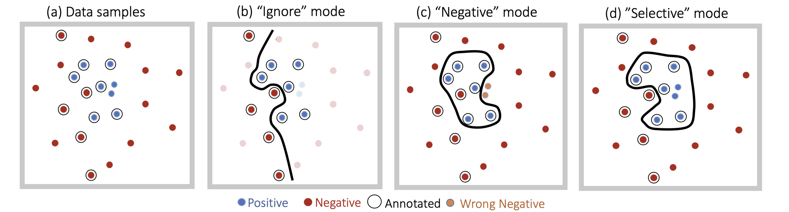
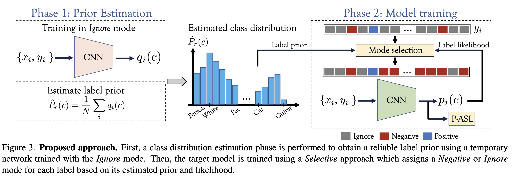

# Multi-label Classification with Partial Annotations using Class-aware Selective Loss

<br> [Paper](https://arxiv.org/abs/2009.14119) |
[Pretrained models](MODEL_ZOO.md)

Official PyTorch Implementation

> Emanuel Ben-Baruch, Tal Ridnik, Avi Ben-Cohen, Nadav Zamir, Asaf Noy, Itamar
> Friedman, Lihi Zelnik-Manor<br/> DAMO Academy, Alibaba
> Group

**Abstract**

Large-scale multi-label classification datasets are commonly, and perhaps inevitably, partially annotated. That is, only a small subset of labels are annotated per sample.
Different methods for handling the missing labels induce different properties on the model and impact its accuracy.
In this work, we analyze the partial labeling problem, then propose a solution based on two key ideas. 
First, un-annotated labels should be treated selectively according to two probability quantities: the class distribution in the overall dataset and the specific label likelihood for a given data sample.
We propose to estimate the class distribution using a dedicated temporary model, and we show its improved efficiency over a naive estimation computed using the dataset's partial annotations.
Second, during the training of the target model, we emphasize the contribution of annotated labels over originally un-annotated labels by using a dedicated asymmetric loss.
Experiments conducted on three partially labeled datasets, OpenImages, LVIS, and simulated-COCO, demonstrate the effectiveness of our approach. Specifically, with our novel selective approach, we achieve state-of-the-art results on OpenImages dataset. Code will be made available.

<!-- ### Challenges in Partial Labeling
(a) In a partially labeled dataset, only a portion of the samples are annotated for a given class. (b) "Ignore" mode exploits only the annotated samples which may lead to a limited decision boundary. (c) "Negative" mode naively treats all un-annotated labels as negatives. It may produce suboptimal decision boundary as it adds noise of un-annotated positive labels. Also, annotated and un-annotated negative samples contribute similarly to the optimization. (d) Our approach aims at mitigating these drawbacks by predicting the probability of a label being present in the image.
 
<p align="center">
 <table class="tg">
  <tr>
    <td class="tg-c3ow"></td>
  </tr>
</table>
</p> -->

### Class-aware Selective Approach
An overview of our approach is summarized in the following figure:
 
<p align="center">
 <table class="tg">
  <tr>
    <td class="tg-c3ow"></td>
  </tr>
</table>
</p>

#### Loss Implementation 

Our loss consists of a selective approach for adjusting the training mode for each class individualy and a partial asymmetric loss. 
<!-- The selective approach is based on two probabilities quantities: label likelihood and label prior. The partial asymmetric loss emphasizes the contribution of the annotated labels.   -->
An implementation of the Class-aware Selective Loss (CSL) can be found [here](/src/loss_functions/partial_asymmetric_loss.py). 
- ```class PartialSelectiveLoss(nn.Module)```


## Pretrained Models
<!-- In this [link](MODEL_ZOO.md), we provide pre-trained models on various dataset.  -->
We provide models pretrained on the OpenImages datasset with different modes and architectures:

| Model | Architecture | Link | mAP |
| :---            | :---:      | :---:     | ---: |
| Ignore          | TResNet-M | link      | 85.38       |
| Negative        | TResNet-M | [link]    | 85.85       |
| Selective (CSL) | TResNet-M  | [link]   | 86.72       |
| Selective (CSL) | TResNet-L  | [link]   | 87.34       |
 


## Inference Code (Demo)
We provide [inference code](infer.py), that demonstrate how to load our
model, pre-process an image and do actuall inference. Example run of
OpenImages model (after downloading the relevant model):
```
python infer.py  \
--dataset_type=OpenImages \
--model_name=tresnet_m \
--model_path=./models_local/mtresnet_opim_86.72.pth \
--pic_path=./pics/000000000885.jpg \
--input_size=448
```
which will result in:
<p align="center">
 <table class="tg">
  <tr>
    <td class="tg-c3ow"></td>
  </tr>
</table>
</p>

Example run of OpenImages model:
```
python infer.py  \
--dataset_type=OpenImages \
--model_name=tresnet_l \
--model_path=./models_local/Open_ImagesV6_TRresNet_L_448.pth \
--pic_path=./pics/000000000885.jpg \
--input_size=448
```
<p align="center">
 <table class="tg">
  <tr>
    <td class="tg-c3ow"></td>
  </tr>
</table>
</p>


## Training Code
TBD 
## Citation
```
 @misc{benbaruch2020asymmetric, 
        title={Asymmetric Loss For Multi-Label Classification}, 
        author={Emanuel Ben-Baruch and Tal Ridnik and Nadav Zamir and Asaf Noy and Itamar Friedman and Matan Protter and Lihi Zelnik-Manor}, 
        year={2020}, 
        eprint={2009.14119},
        archivePrefix={arXiv}, 
        primaryClass={cs.CV} }
```

## Contact
Feel free to contact if there are any questions or issues - Emanuel
Ben-Baruch (emanuel.benbaruch@alibaba-inc.com) or Tal Ridnik (tal.ridnik@alibaba-inc.com).
